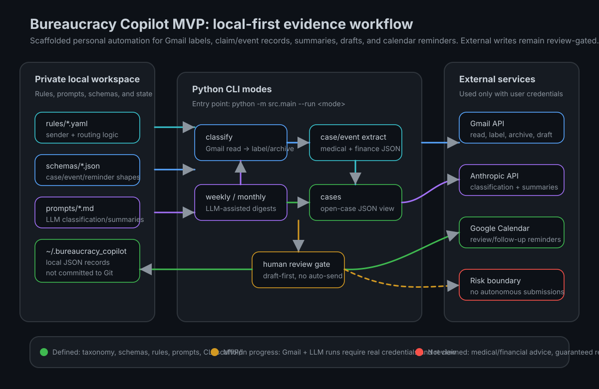
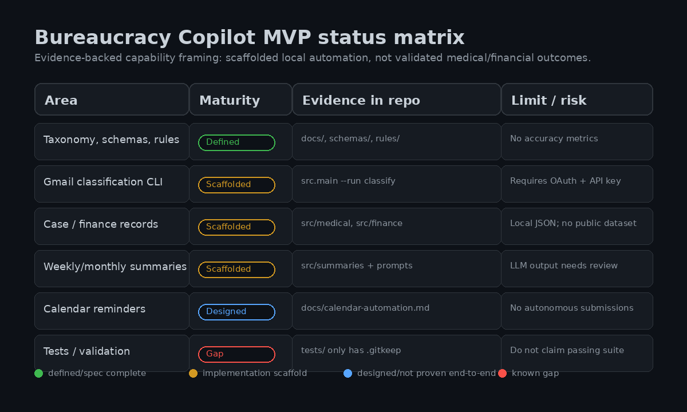

# Bureaucracy Copilot

Local-state-first MVP scaffold for personal Gmail and Google Calendar bureaucracy workflows.

This repository is a Python 3.11+ prototype for organizing administrative email into reviewable records: Gmail labels, medical-claim case files, finance-event records, weekly/monthly summaries, draft follow-ups, and calendar reminders. It is not a medical, insurance, legal, or financial decision system, and it does not claim validated recovery, savings, or accuracy metrics.

## Current scope

Implemented or scaffolded in this repo:

- Gmail-oriented label taxonomy for action, records, waiting, feeds, and pipeline mail.
- YAML rules, JSON schemas, and prompt templates for classification, claim cases, finance events, summaries, and reminders.
- CLI entry point in `src/main.py` with `classify`, `weekly`, `monthly`, and `cases` modes.
- Local JSON persistence under `~/.bureaucracy_copilot/` for case, event, and summary artifacts.
- Draft-first and human-review framing for actions that affect email, calendar, insurers, or other third parties.

Not proven here:

- No public benchmark dataset or accuracy report.
- No verified money-recovered, time-saved, reimbursement-success, or medical/financial outcome claim.
- No automated insurer submission flow.
- No meaningful test suite yet; `tests/` currently contains only `.gitkeep`.

## Workflow and capability map





## Quick start

```bash
git clone https://github.com/googa27/bureaucracy-copilot.git
cd bureaucracy-copilot

python -m pip install -r requirements.txt
python -m pip install -e .

cp .env.example .env
# Fill ANTHROPIC_API_KEY.
# For Gmail/Calendar modes, provide Google OAuth credentials as described in .env.example.
```

Run modes from the repository root:

```bash
# Classify inbox messages, apply BC labels, and optionally archive according to rules.
python -m src.main --run classify

# Generate a weekly hygiene summary from local case state.
python -m src.main --run weekly

# Generate a monthly finance digest for a specific month.
python -m src.main --run monthly --month YYYY-MM

# Print open locally stored cases as JSON.
python -m src.main --run cases
```

Notes on the current CLI:

- **Known import blocker:** the tracked `src/__init__.py` currently contains a bare `placeholder` name, so all `python -m src.main ...` examples above stop with `NameError` before dispatch. The commands document the intended route only; remove or replace that placeholder before treating them as runnable.
- `python -m src.main --run cases` does not call Gmail, but the current entry point still checks for `ANTHROPIC_API_KEY` before dispatching.
- `classify`, `weekly`, and `monthly` use Anthropic client creation; `classify`, `weekly`, and `monthly` also build a Gmail service in the current dispatch path.
- The old README commands `python -m src.ingestion.run` and `python -m src.summaries.weekly` do not match tracked modules; use `src.main` modes instead.

## Repository map

```text
bureaucracy-copilot/
├── README.md
├── PRD.md
├── PLAN.md
├── docs/
│   ├── architecture.md
│   ├── calendar-automation.md
│   ├── data-model.md
│   ├── insurer-routing.md
│   ├── label-taxonomy.md
│   ├── privacy-and-risk.md
│   ├── summaries.md
│   └── assets/
├── prompts/                 # LLM prompt templates
├── rules/                   # YAML classification and routing rules
├── schemas/                 # JSON Schema contracts
├── src/
│   ├── calendar/            # Calendar reminder scaffolding
│   ├── classification/      # Email classification
│   ├── finance/             # Financial event extraction
│   ├── ingestion/           # Gmail auth/reader helpers
│   ├── medical/             # Claim case tracking
│   ├── outputs/             # Draft/output helpers
│   ├── summaries/           # Weekly/monthly summary helpers
│   └── utils/               # Config/logging
├── notebooks/               # Exploratory notebooks
└── tests/                   # Placeholder only at present
```

## Data and security boundary

This repo is public, but the intended data is private. Do not commit credentials, OAuth tokens, email exports, claim documents, finance events, summaries, generated case files, or screenshots containing personal information.

Expected local/private state:

- Environment variables or local config for `ANTHROPIC_API_KEY`.
- Google OAuth credentials and tokens outside the repo.
- `~/.bureaucracy_copilot/` for local JSON cases, events, and summaries.
- Gmail and Calendar data accessed under the user's own account and scopes.

Safety posture:

- The system should label, summarize, draft, and remind before it sends or submits anything.
- Ambiguous claim routing, finance parsing, and outbound messaging require human review.
- Source emails remain the audit trail; structured records should link back to evidence.
- “Local-state-first” is not “local-only processing”: the current medical case tracker can send sender/subject/date plus up to 2,000 characters of an email body to Anthropic, and the Calendar helper can write insurer, amount, provider, service-date, and missing-document metadata into an event.
- Use only accounts, calendars, and Anthropic processing that are appropriate for the data; redact or disable those paths when that disclosure is unacceptable. Sensitive medical/financial details should be minimized in prompts, logs, calendar text, screenshots, and public issues.

## Status

| Area | Status | Evidence | Caveat |
|---|---|---|---|
| Product docs | Defined | `PRD.md`, `PLAN.md`, `docs/` | Product language is aspirational; README reflects current MVP truth. |
| Label taxonomy | Defined | `docs/label-taxonomy.md`, `rules/gmail_sender_rules.yaml` | Needs live mailbox validation. |
| Schemas | Defined | `schemas/*.schema.json`, `docs/data-model.md` | Schema validation is not wired through a test suite yet. |
| Gmail classification | Scaffolded | `src/main.py`, `src/ingestion/`, `src/classification/` | Requires OAuth, Anthropic key, and careful review. |
| Medical case tracking | Scaffolded | `src/medical/case_tracker.py` | Not medical advice; no submission automation or reimbursement guarantee. |
| Finance event extraction | Scaffolded | `src/finance/event_extractor.py` | Not financial advice; no accuracy metrics. |
| Summaries | Scaffolded | `src/summaries/`, `prompts/` | LLM summaries need review before action. |
| Calendar reminders | Designed/scaffolded | `docs/calendar-automation.md`, `src/calendar/` | Do not include sensitive details in public or shared calendar text. |
| Tests | Gap | `tests/.gitkeep` | Do not advertise passing tests until real tests exist. |

## Documentation

- [Architecture](docs/architecture.md)
- [Data model](docs/data-model.md)
- [Label taxonomy](docs/label-taxonomy.md)
- [Insurer routing](docs/insurer-routing.md)
- [Calendar automation](docs/calendar-automation.md)
- [Summaries](docs/summaries.md)
- [Privacy and risk](docs/privacy-and-risk.md)

## License

Private / personal-use repository. No open-source license is provided, so redistribution or reuse is not granted by default.
